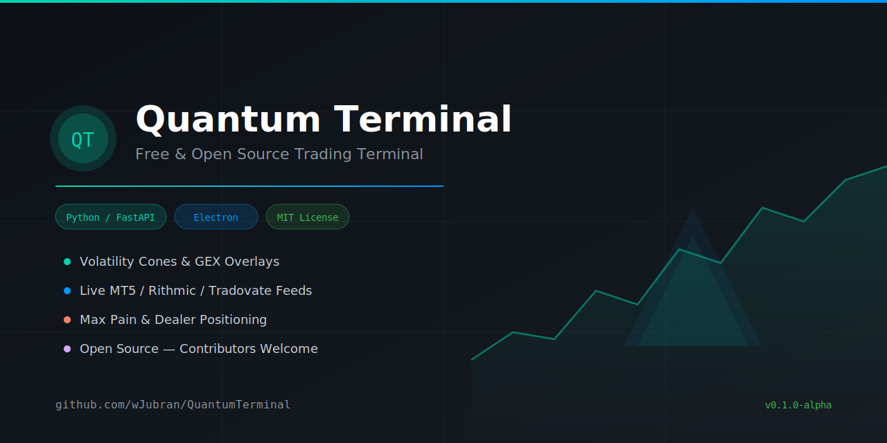

# 🌌 Quantum Terminal

<div align="center">
  <p><strong>A Next-Generation Open Source Trading & Quantitative Analysis Platform</strong></p>
  
  
  
  
</div>

---

## 📖 About The Project (نظرة عامة على المشروع)

**Quantum Terminal** is an advanced, fully free, and open-source trading terminal designed to bridge the gap between institutional-grade quantitative analysis and retail day trading. 

Unlike traditional platforms that rely on lagging indicators (like RSI or MACD), Quantum Terminal processes **real-time tick data** from professional brokerages and overlays complex mathematical probability models directly onto your charts. It acts as a localized display hub, separating heavy mathematical computations from real-time charting to ensure zero-latency trade monitoring.

---

## 📸 Screenshots

### Trading Interface — XAUUSD with Volatility Bands & Order Management


### Volatility Cones — Probability-Based Price Envelopes


---

## ✨ Core Features (المميزات الأساسية)

### 1. 🌐 Multi-Provider Live Feeds (ربط مباشر مع الأسواق)
Quantum Terminal is built to handle ultra-fast data streams from the most reliable data providers in the industry:
- **MetaTrader 5 (MT5):** Direct integration via Python API for Forex, Crypto, and CFD markets.
- **Rithmic:** High-frequency, sub-millisecond tick processing for CME Futures (NQ, ES).
- **Tradovate:** Seamless integration for retail futures traders.
*(The platform features a dedicated `focus_tick_loop` ensuring the chart you are actively watching refreshes at maximum FPS without bottlenecking the system).*

### 2. 📐 Advanced Quantitative Models (النماذج الكمية المتقدمة)
Move beyond simple support and resistance. The platform integrates institutional volatility models to forecast price action probabilities:
- **Volatility Cones:** Visualizing expected price ranges using Geometric Brownian Motion (**GBM**), Merton Jump Diffusion (**MJD**), and **Bates** models.
- **Scalp Bands & Micro Volatility:** Real-time bands designed specifically for high-frequency scalpers.
- **Probability Fields:** Heatmaps mapping the statistical likelihood of price reverting or trending.

### 3. 🌊 Options Flow & Market Maker Positioning (تحليل سيولة الخيارات)
Understanding where Market Makers are hedging is critical. Quantum Terminal visualizes:
- **Gamma Exposure (GEX):** Identifies sticky price levels and volatility triggers.
- **Max Pain:** Highlights the strike price with the most open options contracts.
- **Option Walls:** Visualizes heavy Call/Put resistance and support barriers.

### 4. 🌍 Macro Regime & Sector Rotation (تحليل الماكرو والسيولة)
Using data from `yfinance`, the terminal analyzes global market regimes:
- Tracks ETF Sector Rotation to see where smart money is flowing.
- Identifies the current market regime (Risk-On, Risk-Off, Inflationary, etc.) to align your trades with the broader macroeconomic trend.

---

## 🏗️ Architecture & Repository Structure (هيكلية المشروع)

The project follows a decoupled architecture, ensuring the UI remains buttery smooth while the backend handles heavy lifting.

```text
QuantumTerminal/
├── backend/                # The Core Engine (Python/FastAPI)
│   ├── providers/          # MT5, Rithmic, and Tradovate API wrappers
│   ├── data_server.py      # Main FastAPI server and WebSocket broadcaster
│   └── launcher.py         # Entry point and config manager
│
├── electron_shell/         # Desktop Application Wrapper
│   ├── main.js             # Electron main process
│   └── preload.js          # Security and IPC bridging
│
└── frontend_build/         # Compiled React UI
    ├── index.html          # Main entry point
    └── static/             # Minified JS/CSS for the charting interface
```

> **Note on Open Source:** The Python backend and Electron shell are fully open source. The React frontend is provided as a compiled production build (`frontend_build/`), meaning it is fully functional and ready to run, though the raw `.jsx` source files are not included in this repository.

---

## 🚀 Getting Started (طريقة التشغيل)

### Prerequisites
- **Python 3.10** or higher.
- **MetaTrader 5** (If you intend to use the MT5 data feed).
- `Node.js` (Optional, if you wish to re-package the Electron shell).

### Installation
1. Clone the repository:
   ```bash
   git clone [https://github.com/wJubran/QuantumTerminal.git](https://github.com/wJubran/QuantumTerminal.git)
   cd QuantumTerminal/backend
   ```
2. Install Python dependencies:
   ```bash
   pip install fastapi uvicorn websockets watchfiles yfinance MetaTrader5
   ```
3. Run the Backend Server:
   ```bash
   python launcher.py
   ```
4. The terminal will automatically serve the UI on `http://127.0.0.1:8502` and launch your default browser. 

*(To run as a standalone desktop app, you can package the `electron_shell` directory using Electron Forge or Electron Builder).*

---

## 🛠️ Contributing (المساهمة)
This is a community-driven project! If you are a Python developer, Quant, or React engineer, your pull requests are welcome. 
- **Areas needing help:** Enhancing thread safety for MT5 in `data_server.py`, adding new broker providers (like Interactive Brokers), and rebuilding an open-source React UI.

## ⚖️ Disclaimer
*Quantum Terminal is for educational and analytical purposes only. Trading financial markets carries a high level of risk and may not be suitable for all investors. The mathematical models provided by this software are probabilistic, not predictive.*

## 📄 License
This project is licensed under the **MIT License**. See the [LICENSE](LICENSE) file for more details.
